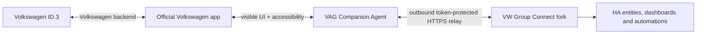

# VW ID.3 Companion for Home Assistant

Home Assistant integration that reads and controls a **Volkswagen ID.3 through
the official Volkswagen Android app running on a dedicated companion phone**.

This is a personal, experimental fork of
[`its-me-prash/vwgroup-connect-ha`](https://github.com/its-me-prash/vwgroup-connect-ha).
It exists because normal Volkswagen API integrations can lose access when
authentication, signing or backend behavior changes. This fork lets the genuine
Volkswagen app keep doing the authenticated work on a genuine Android device.

> [!IMPORTANT]
> The supported and tested target is **Volkswagen ID.3 + Volkswagen app 4.3.2
> in English + Pixel 4a / Android 13 + Home Assistant OS**. Other Volkswagen
> models may work when they expose the same app screens, but this is not
> guaranteed. Other brands and app versions are outside this fork's support
> scope even if inherited upstream code or setup choices are still visible.

> [!WARNING]
> This project can send real climate and charging commands to a real vehicle.
> Test every control manually before using it in an automation. It is not
> affiliated with or endorsed by Volkswagen AG or Home Assistant.

## What it does

The integration does not extract Volkswagen credentials, intercept HTTPS or
reimplement Volkswagen's private request signing. Instead, a small Android
AccessibilityService observes the **visible** Volkswagen UI and performs only
the gestures requested by your Home Assistant instance.



Normal operation is **ADB-free**:

- the phone opens an outbound HTTPS long-poll to Home Assistant;
- commands travel back in the response;
- overview changes are pushed when Android emits an accessibility event;
- phone IP changes and Wi-Fi client isolation do not affect the relay;
- Wireless Debugging can stay off after installation;
- no root access is required.

The phone IP is used only once during initial setup to verify the installed
Agent and Volkswagen app. The entry then migrates automatically to the outbound
relay using the shared random token.

## Confirmed functionality on the ID.3

### Data read from the Volkswagen overview

| Data | HA behavior |
|---|---|
| Traction battery level | Battery sensor in `%` |
| Electric range | Distance sensor in `km` |
| Vehicle locked/unlocked | `Doors Locked` binary sensor |
| Charging | `CHARGING`, `CONSERVATION_CHARGING`, `NOT_CHARGING` |
| Climate running/stopped | Climate entity state |
| Individual doors | Front left/right and rear left/right |
| Individual windows | Front left/right and rear left/right |
| Boot and bonnet | Individual binary sensors |
| Exterior lights | Four individual sensors plus aggregate/count |
| Volkswagen sync age | Diagnostic source-age value |

Overview events are debounced for about 300 ms and sent to HA immediately.
Actual freshness still depends on when the official Volkswagen app receives an
update from Volkswagen and the car.

### Extended reads

When **Companion: read all confirmed ID.3 screens** is enabled, the integration
safely navigates the app about every 15 minutes, reads the values, and always
returns to the vehicle overview.

| Screen | Confirmed data |
|---|---|
| Climate | Desired temperature, outside temperature, climate preferences |
| Climate settings | Automatic window heating, auxiliary AC at unlock, front zones |
| Charging settings | Charge target, Battery Care, reduced AC current, connector release |
| Vehicle Health | Total distance and next-service countdown |
| Vehicle map/share | Parking coordinates from the shared Google Maps URL |

The app refers internally to an inside temperature, but it does **not** expose a
numeric cabin temperature in its visible or accessibility UI. `cabin_temp`
therefore remains unavailable on this companion channel.

### Controls

- start and stop climate control;
- stage a desired temperature and apply it together with climate on/off;
- automatic window heating;
- auxiliary air conditioning at unlock;
- front-left and front-right climate zones;
- start and stop charging;
- charge target;
- Battery Care mode;
- maximum/reduced AC charging current;
- automatic release of the AC connector.

The driver verifies known Volkswagen resource IDs and app version before it
taps. Unknown layouts fail visibly instead of guessing coordinates.

### Companion phone diagnostics

- Android phone battery percentage, updated by relay heartbeat roughly every
  20 seconds;
- Agent and Volkswagen app versions;
- relay/source state;
- a dim screen wake lock so a dedicated phone remains available when its smart
  plug disconnects the charger.

## Requirements

- Home Assistant OS or another HA installation supported by HACS;
- a spare Android phone on the same LAN for initial setup;
- Android 9 or newer for the Agent (only Android 13 is verified here);
- official **Volkswagen** app version **4.3.2**, set to English;
- the Volkswagen app signed in and showing the intended ID.3;
- the 17-character VIN;
- an HA URL reachable from the phone. HTTPS is strongly recommended;
- a Wi-Fi network where HA can contact the phone on TCP `8765` once during
  setup. Normal relay traffic is phone → HA.

## Installation for non-technical users

### 1. Install this fork through HACS

1. Open **HACS** in Home Assistant.
2. Open the menu and choose **Custom repositories**.
3. Add:

   ```text
   https://github.com/jasin755/vwgroup-connect-ha
   ```

4. Select category **Integration**.
5. Find **VW Group Connect**, download it, and restart Home Assistant.

If HACS already contains the upstream repository, confirm that the installed
custom repository URL points to `jasin755/vwgroup-connect-ha`.

### 2. Prepare the Android phone

1. Install the official Volkswagen app from Google Play.
2. Set the Volkswagen app to **English**.
3. Sign in and confirm that the ID.3 overview, charging and climate screens
   work manually.
4. Keep the phone on reliable Wi-Fi.
5. For a dedicated device, minimum brightness, Dark Theme, Airplane mode with
   Wi-Fi re-enabled, and disabled Wi-Fi/Bluetooth location scanning reduce
   consumption.

Do not enable Battery Saver until setup is working. Extreme Battery Saver can
pause the Agent. If standard Battery Saver is used, keep **VAG Companion Agent**
and **Volkswagen** unrestricted in Android's app battery settings.

### 3. Install the prebuilt Agent APK

Download the current APK directly:

**[Download VAG Companion Agent APK](https://raw.githubusercontent.com/jasin755/vwgroup-connect-ha/main/android/companion-agent/releases/vag-companion-agent.apk)**

On Android, allow installation from the browser or file manager when prompted,
then open the downloaded APK. No ADB, root or Wireless Debugging is required.

Current SHA-256:

```text
1a749824d10b49f6f8a2122599c82c8c7cf310286b055d5420afb2ac0d4e6aa7
```

Repository files:

- [`android/companion-agent/releases/vag-companion-agent.apk`](android/companion-agent/releases/vag-companion-agent.apk)
- [`android/companion-agent/releases/SHA256SUMS`](android/companion-agent/releases/SHA256SUMS)

Optional verification on macOS/Linux:

```bash
shasum -a 256 vag-companion-agent.apk
```

### 4. Configure the Agent on the phone

Open **VAG Companion Agent**:

1. Enter the Home Assistant base URL, for example:

   ```text
   https://home.example.com
   ```

   A local `http://homeassistant.local:8123` URL can work on a trusted LAN, but
   sends the shared token without TLS. Prefer HTTPS.

2. Tap **Generate secure token**.
3. Tap **Copy token for Home Assistant**; you will paste the same token into HA.
4. Tap **Save Home Assistant configuration**.
5. Tap **Open Accessibility settings**.
6. Enable **VAG Companion Agent** and accept Android's accessibility warning.
7. Return to the Agent and confirm that configuration and AccessibilityService
   are both shown as enabled.
8. Tap **Open Volkswagen app** and leave it on the ID.3 overview.

The Agent may receive HTTP 404 responses until the HA config entry exists. This
is expected; it retries automatically and never sends the token to any other
host.

### 5. Find the phone's current IP address

On a Pixel:

**Settings → About phone → IP address**

You can also open the connected Wi-Fi network details. The address is needed
only for the first probe; no DHCP reservation is required after relay migration.

### 6. Add the integration in Home Assistant

1. Open **Settings → Devices & services → Add integration**.
2. Search for **VW Group Connect**.
3. Choose **ID.3 Companion / Android Agent**.
4. Enter:

   | Field | Value |
   |---|---|
   | Vehicle brand | `Volkswagen` |
   | Companion Agent IP | Current phone IP |
   | Agent API port | `8765` |
   | VIN | The ID.3 VIN |
   | S-PIN | Optional |
   | Agent token | Exact token saved in the Agent |

5. Submit the form.

HA verifies the Agent over the LAN, creates the entry, and binds the outbound
relay by the unique token. No internal config-entry ID is copied and no ADB
Bridge add-on is needed.

### 7. Enable ID.3 extended screens

Open the integration's **Configure / Options** and enable:

- **Companion: read charge target (navigates the app)**
- **Companion: read all confirmed ID.3 screens**

Reload the integration when requested. During the first extended refresh the
phone visibly walks through climate, settings, health and map screens. It should
finish on the ID.3 overview.

### 8. Verify the result

Expected signals:

- integration title contains **Companion Agent**;
- `Data source channel` is `companion_relay` in diagnostics;
- `Companion phone battery` has a percentage;
- `Battery Level`, `Electric Range`, `Doors Locked` and `Charging Status` have
  values;
- changing a door/window/light in the car updates HA after the Volkswagen app
  receives the change;
- Wireless Debugging is off.

## Updating

### Home Assistant integration

Update through HACS and restart HA.

### Android Agent

Download the APK from the same link and install it over the existing copy.
Android should preserve the relay URL, token and enabled AccessibilityService.

Do not uninstall the old Agent unless necessary; uninstalling removes its saved
configuration. If Android reports a signature mismatch, stop and open an issue
instead of uninstalling immediately.

## Troubleshooting

| Symptom | What to check |
|---|---|
| HA cannot contact Agent during setup | Same LAN, correct phone IP, port `8765`, AccessibilityService enabled, token identical |
| Agent configuration says missing | Enter HA URL, generate/paste token, tap Save |
| Relay never comes online | HA URL must be reachable from phone; reverse proxy must allow POST to `/api/vag_connect/companion_agent/by-token` |
| HTTP 404 before HA setup | Expected; create the HA companion entry with the same token |
| Values are unknown | Volkswagen app 4.3.2 in English, logged in, ID.3 overview visible |
| Overview updates but Settings/Health/GPS do not | Enable both extended companion options and wait for the 15-minute navigation cycle |
| App ends on another screen | Open the vehicle overview, reload integration, download diagnostics if it repeats |
| Doors/windows remain open after closing all | Use integration 4.4.2 or newer |
| `could not return to overview` repair | Use 4.5.2 or newer; a one-off transition is failure-soft |
| No phone battery sensor | Agent 0.5.0+ and integration 4.5.0+, then restart HA |
| Display turns off | Agent 0.5.1+, AccessibilityService enabled; `/health` should show `keep_screen_awake: true` |
| Commands unavailable | Confirm app version is accepted and `companion_writes_enabled` is true in diagnostics |

### Direct Agent health check

From a machine on the phone's LAN:

```bash
curl -H 'X-Token: YOUR_TOKEN' http://PHONE_IP:8765/health
```

Healthy Agent 0.6.0 output includes:

```json
{
  "status": "ok",
  "vw_version": "4.3.2",
  "phone_battery_level": 58,
  "keep_screen_awake": true
}
```

Never post the real token publicly.

### Diagnostics for bug reports

Open:

**Settings → Devices & services → VW Group Connect → Download diagnostics**

Attach the JSON plus:

- integration version;
- Agent version;
- Volkswagen app version and language;
- Android model/version;
- which exact screen or command failed;
- whether the official app itself shows the expected value.

The integration masks VINs, coordinates and configured tokens, but review an
export before posting it publicly.

## Notes for AI assistants

This section is intentionally explicit so an AI assistant can use this README
as the primary runbook instead of suggesting obsolete ADB procedures.

### Supported baseline

```text
Vehicle: Volkswagen ID.3
Volkswagen Android app: 4.3.2, English
Verified phone: Pixel 4a, Android 13
Agent package: me.pognerebko.vagcompanion
Agent LAN port: 8765
Normal transport: outbound HTTPS relay
Initial discovery: direct LAN Agent probe, then automatic token binding
Normal ADB requirement: none
```

### Important invariants

1. Use the prebuilt APK and phone-side setup before configuring HA.
2. The same random token must be saved in the Agent and HA entry.
3. The user never needs the HA config-entry ID.
4. Do not recommend the ADB Bridge or Wireless Debugging for Agent 0.6.0+
   onboarding.
5. Do not ask for Volkswagen credentials, OAuth tokens, app-private files or
   intercepted network traffic.
6. The Volkswagen app must remain signed in, English and available on the
   dedicated phone.
7. `companion_relay` is the expected source channel after setup.
8. Overview fields are event-driven; extended screens are sampled on a bounded
   navigation cadence.
9. A missing UI value cannot be invented. Cabin temperature is a known example.
10. Before changing selectors, collect a masked diagnostics export and a live
    accessibility snapshot from the exact failing screen.

### Relevant implementation files

```text
custom_components/vag_connect/companion/channel.py       read/write orchestration
custom_components/vag_connect/companion/vw_driver.py     grounded ID.3 navigation
custom_components/vag_connect/companion/vw_screen.py     pure screen parsers
custom_components/vag_connect/companion/relay.py         outbound HA relay
custom_components/vag_connect/companion/presets.py       version/selector allow-list
android/companion-agent/                                 Android AccessibilityService
tests/test_companion_id3_extended.py                     grounded ID.3 regressions
```

### Safe diagnostic order

1. Confirm HA integration, Agent and Volkswagen app versions.
2. Check Agent `/health` locally.
3. Check HA diagnostics for `source_channel`, last poll success and Error
   Reporter traceback.
4. Compare the official app's visible state with HA.
5. Determine whether the failure is overview parsing, extended navigation,
   relay transport or an actual Volkswagen-app/backend state.
6. Keep last-known-good HA data on transient failures; never replace it with
   fabricated `false`, `0` or `unknown` values.

## Development

Python checks used by this fork:

```bash
python -m pytest -q tests/
ruff check custom_components/
mypy custom_components/vag_connect/ \
  --ignore-missing-imports \
  --disallow-untyped-defs \
  --disallow-incomplete-defs \
  --warn-return-any
```

Android Agent:

```bash
cd android/companion-agent
./gradlew test lintDebug assembleDebug
```

The APK output is:

```text
android/companion-agent/app/build/outputs/apk/debug/app-debug.apk
```

When publishing a new prebuilt APK, update together:

- Agent `versionCode` and `versionName`;
- `releases/vag-companion-agent.apk`;
- `releases/SHA256SUMS`;
- APK checksum in this README;
- integration manifest/changelog when HA behavior changes.

## Security and privacy

- The Agent accepts a random URL-safe token of at least 32 characters.
- The token-discovery endpoint resolves only one exact broker match; duplicated
  tokens fail closed.
- Prefer HTTPS for phone → HA relay traffic.
- The Agent observes only `com.volkswagen.weconnect` accessibility windows.
- It does not read Volkswagen app storage, credentials or private API tokens.
- The local API is intended for a trusted LAN and always requires the token.
- The prebuilt APK is small and built from the source in this repository; verify
  its SHA-256 before installation.

## Upstream, licence and responsibility

> ### 📛 Historical rename note
> The upstream project was previously published as **`vag-connect-ha`**. The
> display name changed, but entity IDs and services such as
> `vag_connect.show_vag` remained compatible. See
> [`MIGRATION.md`](MIGRATION.md) for the complete history. Community credit for
> catching the naming problem belongs to **Si Gregory**, **Ben Johnson**,
> **Evets David** and **Jordan Waeles**.

This fork builds on the extensive work in
[`its-me-prash/vwgroup-connect-ha`](https://github.com/its-me-prash/vwgroup-connect-ha)
and its contributors. See [ATTRIBUTION.md](ATTRIBUTION.md),
[CONTRIBUTORS.md](CONTRIBUTORS.md), [NOTICE](NOTICE) and [LICENSE](LICENSE).

The integration and companion additions are distributed under the repository's
GNU AGPL v3.0-or-later terms. Use at your own risk. Volkswagen trademarks belong
to their respective owners.
